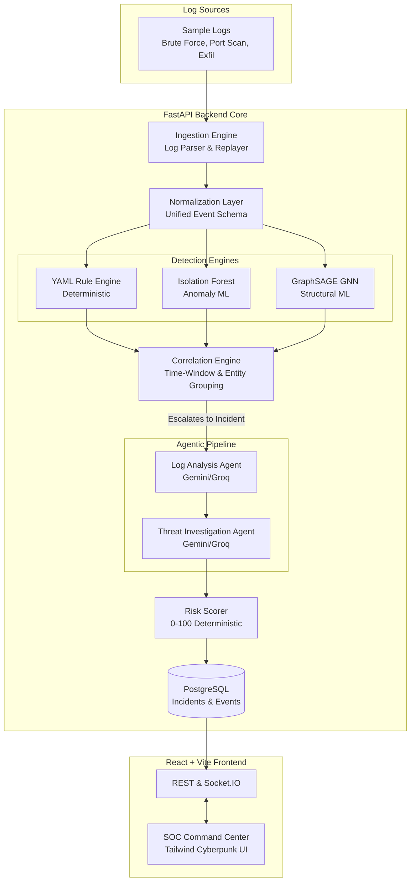

# Agentic AI Cybersecurity Assistant (SIH26S01)

An automated Threat Investigation and Incident Response platform built for the **Agentic AI Cybersecurity Assistant** problem statement (SIH26S01).

This prototype acts as an autonomous Tier-1/Tier-2 Security Operations Center (SOC). It ingests security logs, runs them through deterministic and ML detection engines, correlates them into incidents, and deploys specialized LLM agents to investigate, score risk, and recommend response actions.

---

## 🏗️ System Architecture

The system uses a 2-tier architecture (FastAPI Backend + React Frontend), eliminating legacy middleware, and leverages a multi-stage detection and agentic pipeline.



## 🚀 Key Features

* **Hybrid Detection:** Uses Sigma-inspired YAML rules for known threats and Isolation Forest / GraphSAGE for zero-day anomalies.
* **Agentic Investigation:** Two specialized AI agents (L1 Log Analysis, L2 Threat Investigation) autonomously triage alerts, extract IOCs, and map to MITRE ATT&CK.
* **Deterministic Risk Scoring:** Assigns a 0-100 score based on severity, volume, confidence, and critical asset involvement, preventing AI hallucinations in scoring.
* **Cyberpunk Dashboard:** A real-time, glassmorphic UI built with Tailwind CSS, Recharts, and Framer Motion.
* **Simulation Engine:** Built-in replayer for 3 deterministic attack scenarios (Brute Force, Reconnaissance, Data Exfiltration).

## 💻 Getting Started

### 1. Backend Setup
```bash
cd backend
python -m venv venv
source venv/Scripts/activate  # Windows
pip install -r requirements.txt

# (Optional) Create a .env file for AI capabilities
# GEMINI_API_KEY=your_google_gemini_key
# GROQ_API_KEY=your_groq_key

uvicorn main:app --reload --port 8000
```

### 2. Frontend Setup
```bash
cd frontend
npm install
npm run dev
```

The SOC dashboard will be available at `http://localhost:5173`.

---

## 🚧 What is Remaining (Future Polish & Next Steps)

While the core pipeline and architecture are fully scaffolded, the following items are remaining to make the system 100% production-ready for the SIH submission:

1. **Frontend Real-Time Socket Binding:** 
   * *Current State:* The UI is built and uses mock intervals to simulate the streaming events.
   * *Remaining:* Bind the `socket.io-client` in `Frontend/src/context/SocketContext.tsx` to listen directly to the FastAPI backend's WebSocket emissions.
2. **GraphSAGE Model Retraining:**
   * *Current State:* The architecture and adapter are implemented, but the saved model checkpoint (`best_graphsage_model.pth`) is trained on CIC-IDS2017 NetFlow data.
   * *Remaining:* Train the PyTorch Geometric model specifically on the unified `NormalizedEvent` feature space.
3. **PDF Report Generation:**
   * *Current State:* The `ReportGenerator` produces a structured Markdown document.
   * *Remaining:* Integrate `ReportLab` or `WeasyPrint` to convert the Markdown output into a downloadable PDF for the final demo.
4. **Database Migrations:**
   * *Current State:* SQLAlchemy models (`NormalizedEvent`, `SecurityIncident`) are defined and use `create_all()` on startup.
   * *Remaining:* Run the `alembic init` and generate the first migration revision for PostgreSQL.
5. **Unit Testing:**
   * *Current State:* The `tests/` directory is scaffolded.
   * *Remaining:* Write `pytest` assertions for the rule engine logic and agent output parsers.
